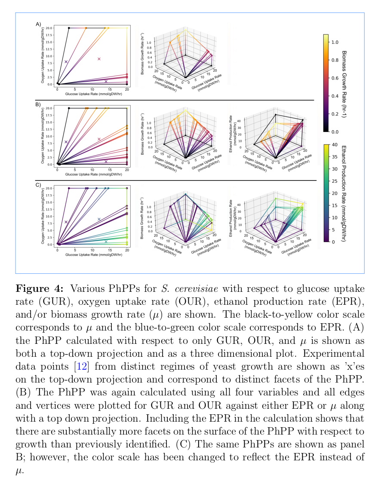

# Flux Envelope Analysis
A Python package and method for generating reduced-dimension solution spaces from large linear programs. It was designed for solving 2D and 3D solution spaces from large linear programs as utilized in constraint-based genome-scale metabolic modeling.

It leverages [optlang](https://github.com/opencobra/optlang) to interface with linear program solvers. This is also the backend that is utilized by [cameo](http://cameo.bio/).

It includes some `matplotlib` plotting functions for generating basic 2D and 3D graphs from the reduced solution spaces (and even 4D if you're willing to use color to represent the fourth dimension).

Some terminology used throught this module:
* **Halfspace or Facet:** A halfspace is a hyper-plane constraint which divides the total solution space in half. In 3D, a halfspace is a bounding plane. In 2D a halfspace is a bounding line. Each halfspace in the final solution is a bounding hyper-plane of the solution space (or a facet).
* **Node:** A node is a unique combination of halfspaces which intersect. These include both facets and vertices depending upon how many halfspaces intersect for a given node. In 3D, a plane node has one halfspace, a line node has two halfspaces, and a vertice node has three halfspaces.
* **Lattice Graph:** This shows the complete set of nodes and the halfspaces they contain

Here's a picture showing a pyramid and the corresponding lattice graph with nodes and halfspaces defined. It also shows how FEA solves the solution; however, read the [full manuscript](docs/_static/FEA_Manuscript.pdf) for more details on how this works.


## Documentation
See [the module documentation](https://htmlpreview.github.io/?https://github.com/long-m-r/fea/blob/main/docs/html/index.html) for full details.

In general, you will be constructing [optlang](https://github.com/opencobra/optlang) linear programs and passing them to the `flux_envelope_analysis` function along with a list of variables the model should be reduced to. It will return a `LatticeGraph` object which contains `Node` and `Halfspace` objects.

General 2D and 3D plotting is provided in `fea.plot` as well as the ability to generate [graphviz](https://graphviz.org/) documents for generating visual graphs from `LatticeGraph` objects.

## Notes

* This code was written in 2017 for [A framework for the identification of promising bio-based chemicals](https://pubmed.ncbi.nlm.nih.gov/29940066/) and was going to be published separately, but due to some unforseen circumstances was not independently published. The [attached manuscript](docs/_static/FEA_Manuscript.pdf) includes technical information regarding the method
* If at all possible, run this package with something other than GLPK. I no longer have access to Gurobi or CPLEX, but it works pretty well with those whereas GLPK *will* cause issues. For example **unit tests utilize random starting models and with GLPK they will randomly fail**.
* See [known issues](https://github.com/long-m-r/fea/issues) for a list of known issues with FEA. Due to no longer having access to academic licenses for solvers, I am somewhat hampered in my ability to rapidly improve the method.

## Examples

There are multiple examples in the [examples subfolder](examples/).

As a general example, let's consider the pyramid shown in the introduction (this example may also be found in the examples subfolder). Let's start with that as the original model and we'll reduce it down to 2D along the x and y variables.

Here's the code to create the original model and the last line reduces it to two dimensions:
```python
from optlang import *
from fea import flux_envelope_analysis

# Start by defining our original pyramid
model = Model(name='Pyramid')
x,y,z = (Variable('x'),Variable('y'),Variable('z'))
model.add([x,y,z])
model.add(Constraint(y,lb=0,name='base'))
model.add(Constraint(-x+y,ub=1,name='left_wall'))
model.add(Constraint(x+y,ub=1,name='right_wall'))
model.add(Constraint(-z+y,ub=1,name='front_wall'))
model.add(Constraint(z+y,ub=1,name='back_wall'))

# Let's solve for what it looks like in 2D from the front
front_view = flux_envelope_analysis(model,[x,y])
```

That's all it really takes, now `front_view` contains the 2D model of the pyramid. Want proof? Let's plot it:
```python
from fea.plot import plot, generate_graphviz

# Get and save the plot
front_figure, front_plot = plot(front_view, x='x', y='y')
front_figure.savefig("./front_view_plot.svg")
```


How about we generate the Lattice Graph image:
```python
import subprocess

# Get graphviz input and generate the image
front_graph = generate_graphviz(front_view)
proc = subprocess.Popen(["dot","-Tpng","-o",'./front_view_graph.png'], stdin=subprocess.PIPE, stdout=subprocess.PIPE, stderr=subprocess.PIPE)
output = proc.communicate(input=front_graph.encode())[0]
```


That's all it takes to get started! You can extend this example to plot x vs z and you should see a square plot instead of a triangle since you'd be looking at it from top/bottom instead of the side.

Once you start applying this to real problems, you can start to gain insights into what is happening in your linear programs, for example, here's Figure 4 from the manuscript:



Without digging too much into the terminology, you can see that the experimental data (marked by `x`) exist in three different parts of the solution space. Furthermore, you can see in panel B and C how the growth rate and ethanol production vary based on the amount of Oxygen available. When there is lots of oxygen, the yeast cells grow fastest and don't need to make much ethanol; however, as oxygen becomes more limited you need to start producing ethanol to continue growing, although growth will be slower than if oxygen was more available. This makes sense, since that's pretty much how brewing beer works!