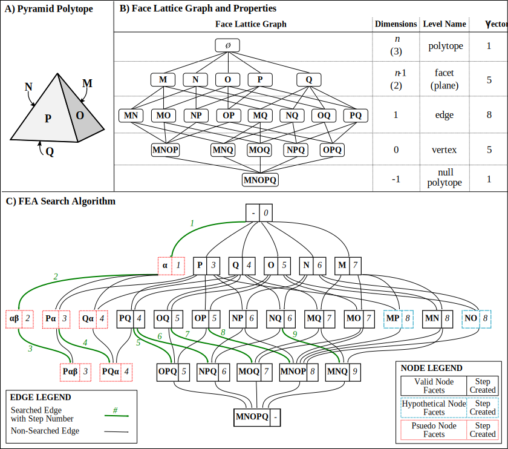
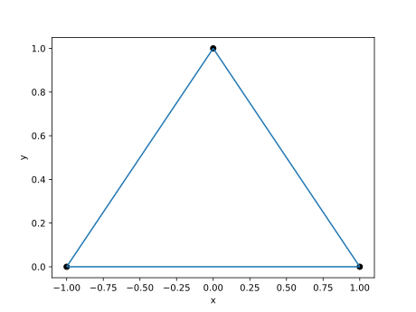
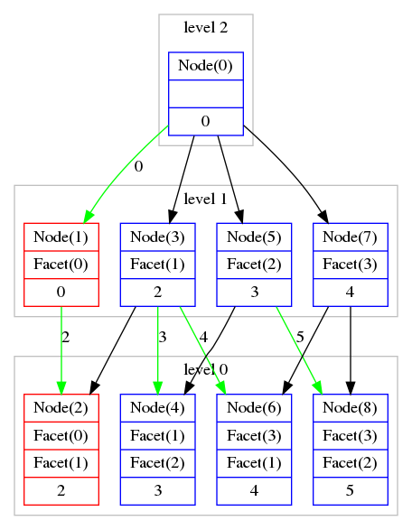

.. FEA documentation master file, created by
   sphinx-quickstart on Tue Dec  5 12:39:10 2017.
   You can adapt this file completely to your liking, but it should at least
   contain the root `toctree` directive.

Flux Envelope Analysis
===============================

This is a Python package for calculating a reduced-dimensional solution space from a larger linear program using optimization. It was designed for solving 2D and 3D solution spaces from large linear programs as utilized in constraint-based genome-scale metabolic modeling.

It leverages `optlang <https://github.com/opencobra/optlang>`_ to interface with linear program solvers. This is also the backend that is utilized by `cameo <http://cameo.bio/>`_.

It includes some :class:`matplotlib` plotting functions for generating basic 2D and 3D graphs from the reduced solution spaces (and even 4D if you're willing to use color to represent the fourth dimension).

Some terminology used throught this module:
* Halfspace: A halfspace is a hyper-plane constraint which divides the total solution space in half. In 3D, a halfspace is a bounding plane. In 2D a halfspace is a bounding line. Each halfspace in the final solution is a bounding hyper-plane of the solution space (or a facet).
* Node: A node is a unique combination of halfspaces which intersect. These include both facets and vertices depending upon how many halfspaces intersect for a given node. In 3D, a plane node has one halfspace, a line node has two halfspaces, and a vertice node has three halfspaces.
* Lattice Graph: This shows the complete set of nodes and the halfspaces they contain

Here's a picture showing a pyramid and the corresponding lattice graph with nodes and halfspaces defined. It also shows how FEA solves the solution; however, read the `full manuscript <./_static/FEA_Manuscript.pdf>`_ for more details on how this works.

Notes and Warnings
==================

* If at all possible, run this package with something other than GLPK. I no longer have access to Gurobi or CPLEX, but it works pretty well with those whereas GLPK *will* cause issues

* This code was written in 2017 for `A framework for the identification of promising bio-based chemicals <https://pubmed.ncbi.nlm.nih.gov/29940066/>`_ and was going to be published separately, but due to some unforseen circumstances was not independently published.

Example
========
For a basic example, we'll start by defining a 3D pyramid as the original model as shown in the image above. The pyramid will have 4 sides and a bottom (or 5 facets/constraints). We'll generate it the original model first and then solve it for just the x and y axes (removing z from consideration)

.. code-block:: python

    from optlang import *
    from fea import flux_envelope_analysis as fea

    # Start by defining our original pyramid
    model = Model(name='Pyramid')
    x,y,z = (Variable('x'),Variable('y'),Variable('z'))
    model.add([x,y,z])
    model.add(Constraint(y,lb=0,name='base'))
    model.add(Constraint(-x+y,ub=1,name='left_wall'))
    model.add(Constraint(x+y,ub=1,name='right_wall'))
    model.add(Constraint(-z+y,ub=1,name='front_wall'))
    model.add(Constraint(z+y,ub=1,name='back_wall'))

    # Let's solve for what it looks like in 2D from the front
    front_view = fea(model,[x,y])

Easy enough, now let's plot the solution space and generate the Lattice Graph as an image:

.. code-block:: python

    from fea.plot import plot, generate_graphviz

    # Get and save the plot
    front_figure, front_plot = plot(front_view, x='x', y='y')
    front_figure.savefig("./front_view_plot.svg")

.. code-block:: python

    import subprocess

    # Get graphviz input and generate the image
    front_graph = generate_graphviz(front_view)
    proc = subprocess.Popen(["dot","-Tpng","-o",'./front_view_graph.png'], stdin=subprocess.PIPE, stdout=subprocess.PIPE, stderr=subprocess.PIPE)
    output = proc.communicate(input=front_graph.encode())[0]

That's all it takes to get started! You can extend this example to plot x vs z and you should see a square plot instead of a triangle since you'd be looking at it from top/bottom instead of the side.

See the manuscript linked above or the various classes listed below for more details.

Index and Documentation
=======================

The main entry point into FEA is the flux_envelope_analysis function documented here. Other documentation is linked at the bottom.

.. automodule:: fea
   :members:

* :ref:`genindex`
* :ref:`modindex`

.. toctree::
   :maxdepth: 2
   :caption: Contents:

   plotting
   internal classes

